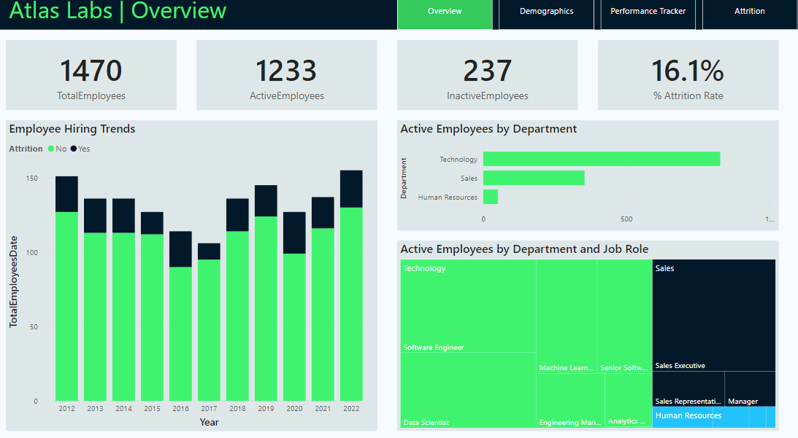
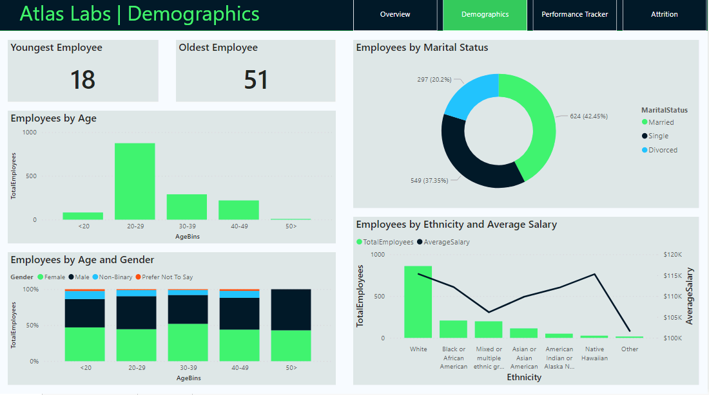

# Interesting-Visuals

### HR Analytics 

##### Human Resources Data Analytics. Here are the key concepts covered in the PowerBI dashboard: #EDA, #navigator pager, #layout design, #custom theme design, #advanced DAX, #USERELATIONSHIP, #trend analysis.

##### USERELATIONSHIP(): is an important advanced DAX concept. Basically, we need to activate inactive relationship between certain tables(e.g., dimension vs. fact) and this allows users to temporarily disable existing active relationship and activate the relationship specified inside the USERELATIONSHIP() function only. Usually, we need calculate() function to perform this action. 

##### layout design: it is a good practice to insert->Buttons -> page navigator and label on each page so that users can navigate each page easily.

##### Below are the snapshots of the endproduct. 

![Overview Human Resources Data Analytics Overview]
![HR Analytics Demographics]
